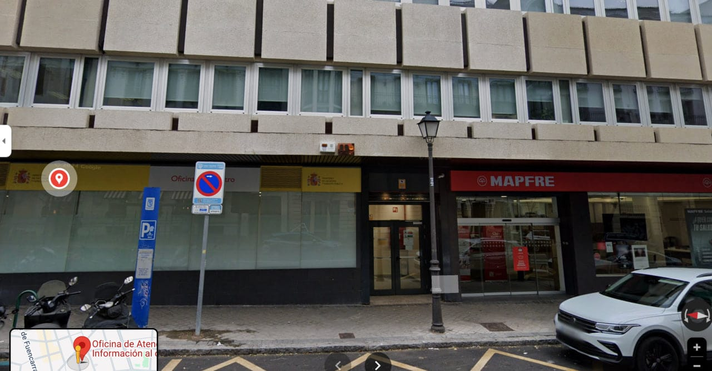

## Виды цифровых подписей

### FNMT

FNMT (Fábrica Nacional de Moneda y Timbre) - национальный монетный двор, выпускающий цифровые сертификаты для электронной подписи. Сертификат FNMT используется для подписи документов, отправки налоговой декларации, подачи заявлений на государственные услуги и т.д. Действителен в течение 4х лет.

### Cl@ve

Это система идентификации, позволяющая гражданам взаимодействовать с государственными органами онлайн.
- **Cl@ve PIN** – временный пароль, который вы получаете из приложения
- **Cl@ve Permanente** – постоянный пароль, который вы создаете самостоятельно
- **Cl@ve Móvil** – подтверждение через мобильное приложение, сосканировав QR-код

### Что лучше?

- Если вам нужен высокий уровень безопасности для юридически значимых документов (например смены данных), FNMT может быть предпочтительнее.
- Если вам нужен простой доступ к госуслугам онлайн, Cl@ve более удобен.

## Как получить?

- [Подробный гайд](https://espanium.notion.site/FNMT-RCM-5bad84eae585424cac1b59bdb4945ddb) как получить FNMT от канала [Espānium](https://t.me/espanium_expert)

- [Как получить цифровой сертификат (все типы)](https://barcelona-startups-relocation.notion.site/How-to-get-a-Digital-Certificate-8ca4ec3ea31b43cd995bfdf2012e622a)

- [Как сделать сертификат ACCV online](https://t.me/lev2tarragona/1977) от канала [Львиные истории про Таррагону](https://t.me/lev2tarragona)

## Советы

- Если во время оформления FNMT, вам нужно подтвердить свою личность, то [в этом офисе](https://maps.app.goo.gl/3q6Ubsizgvh7fVLX7) почти всегда без очередей.
Заходить нужно сбоку здания, в эту дверь рядом с MAPFRE:

