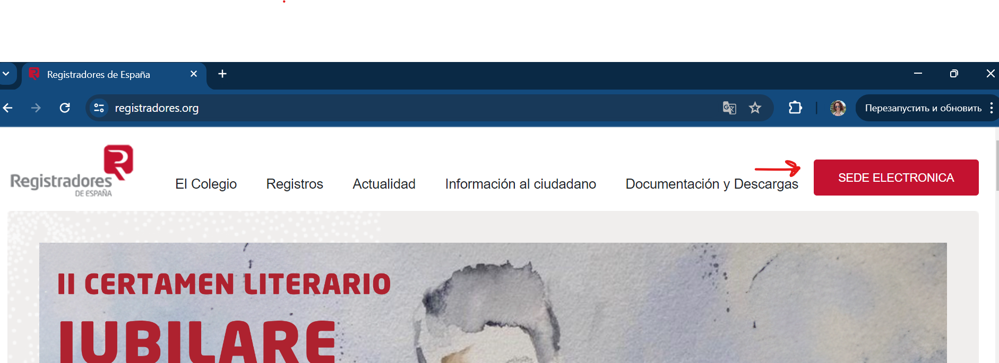
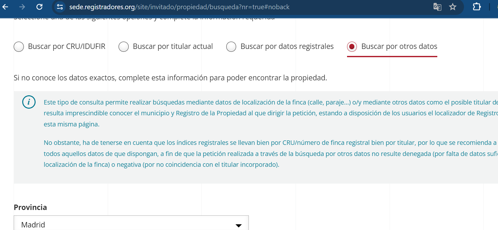
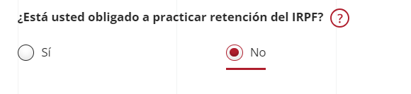

import { Steps } from '@astrojs/starlight/components';

:::note
Nota Simple – это официальный документ, выдаваемый Реестром недвижимости в Испании. Он содержит основную информацию о недвижимом имуществе, включая:

	1.	Идентификацию имущества: местоположение, площадь, описание и кадастровый номер.
	2.	Право собственности: данные о владельцах и их долях в праве собственности.
	3.	Обременения и ограничения: информация о залогах, ипотечных кредитах, сервитутах, арестах и других ограничениях, наложенных на имущество.

Nota Simple используется для проверки правового статуса недвижимости перед ее покупкой, продажей или арендой, чтобы убедиться в отсутствии скрытых проблем или задолженностей.
:::

## Как получить?

<Steps>
1. Открываем сайт [registradores.org](https://www.registradores.org/).

1. Нажимаем “Sede electrónica”.

1. Далее “Solicitar nota simple”.

1. Затем нужно выбрать, как будем искать объект недвижимости. У меня был только адрес, поэтому выбираем “Buscar por otros datos”, и ниже откроется форма, где надо ввести полный адрес.

1. На следующей странице выбираем “En nombre propio” (действуем от своего имени) и указываем, для чего нужна nota simple (например: исследование юридической информации об объекте и его собственнике). Если нужен сразу перевод на английский – можно поставить галочку (это будет стоить 30 евро).

1. На следующей странице вводим персональные данные. Очень важно ввести правильный адрес электронной почты, так как на него придет готовый документ. В конце выбираем пункт про IRPF

1. Далее переходим к странице оплаты. После оплаты готовый документ вышлют на электронную почту (примерно через 4 часа).
</Steps>
