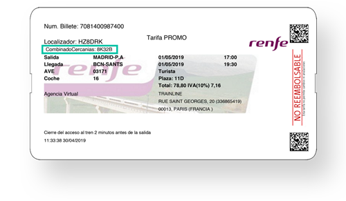

В Мадриде и по всей Испании действуют несколько операторов железнодорожного транспорта, предлагающих как высокоскоростные, так и обычные поезда. 

## Renfe

[Renfe](https://www.renfe.com/es/es) - национальный оператор железных дорог Испании.

- Предлагает широкую сеть маршрутов по всей стране
- Высокоскоростные поезда AVE (Alta Velocidad Española)
- Пригородные поезда Cercanías в крупных городах
- Региональные и междугородние поезда

### Renfe Combinado Cercanías

Renfe предлагает специальную услугу под названием ["Combinado Cercanías"](https://blog.renfe.com/asi-puedes-canjear-el-combinado-cercanias/):

- Бесплатный проезд на пригородных поездах Cercanías, Rodalies и FEVE, а также на трамваях Аликанте при покупке билета на поезда AVE или другие дальние маршруты Renfe (не в Avlo)
- Действует в течение 4 часов до отправления и 4 часов после прибытия дальнего поезда
- Доступно в крупных городах и регионах, включая Мадрид, Барселону, Валенсию, Севилью и другие
- Чтобы воспользоваться услугой, нужно отсканировать QR-код с билета или ввести 5-значный код в автомат на станции Cercanías 

### Бесплатный абонемент (Abono Recurrente)

В 2025 году действует программа бесплатного проезда на поездах Cercanías и Media Distancia для частых пассажиров.

- **Условия:** Необходимо внести залог 10€ (для Cercanías) или 20€ (Media Distancia).
- **Возврат залога:** Если совершить более 16 поездок за 4 месяца, залог возвращается автоматически (при оплате картой) или через кассу.
- **Как оформить:** В приложении [Renfe Cercanías](https://play.google.com/store/apps/details?id=com.renfe.renfecercanias) (рекомендуется, так как генерируется QR-код) или в автоматах на станциях.
- **Срок действия:** Абонементы выдаются на периоды по 4 месяца (январь-апрель, май-август, сентябрь-декабрь).

## Ouigo

[Ouigo](https://www.ouigo.com/es/) - оператор высокоскоростных поездов, принадлежащий французской национальной железнодорожной компании SNCF.

- Предлагает бюджетные высокоскоростные маршруты
- Соединяет Мадрид с такими городами, как Барселона, Валенсия и Аликанте
- Известен своими низкими ценами и простой моделью обслуживания

## Iryo

[Iryo](https://iryo.eu/en/home) - новый частный оператор высокоскоростных поездов в Испании.

- Предлагает маршруты между крупными городами, включая Мадрид, Барселону, Валенсию и Севилью
- Использует современные высокоскоростные поезда
- Акцент на качество обслуживания и экологичность
- Также предоставляет услугу [Combinado Cercanías](#renfe-combinado-cercanías), аналогичную Renfe
