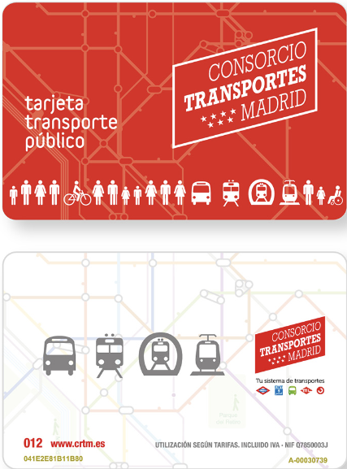
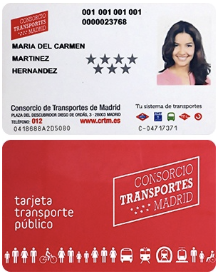
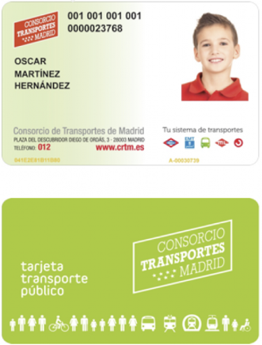
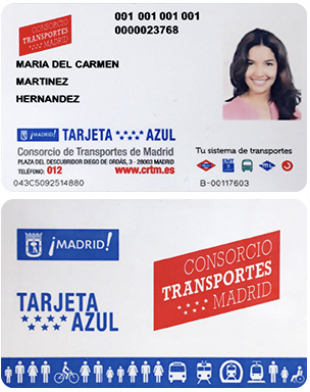

import { LinkCard } from '@astrojs/starlight/components';

<LinkCard title="Карты метро" href="https://www.metromadrid.es/es/viaja-en-metro/plano-de-metro-de-madrid" />

<LinkCard title="Карта тарифных зон" href="https://crtm.es/billetes-y-tarifas/zonas-tarifarias/?zona=A&lang=es" />

<LinkCard title="Карта электричек Cercanías" href="https://www.crtm.es/media/14apxtll/cercanias.pdf" />

## Транспортная карта / Tarjeta Transporte Público (кратко)

:::note[Условия]
- До 4х лет бесплатно, карта не нужна
- 4-6 лет – бесплатно по специальной детской карте
- 7-26 лет – со скидкой по [Carné Joven](https://carnejovenmadrid.com/)
:::

- [Оформить карту (онлайн или оффлайн по записи)](https://tarjetatransportepublico.crtm.es/CRTM-ABONOS/home.aspx)
- Приложение для пополнения и просмотра баланса ([Android](https://play.google.com/store/apps/details?id=com.crtm.recarga&hl=es), [iOS](https://apps.apple.com/es/app/tarjeta-transporte/id1619770175?l=en-GB))
- Для поездки в аэропорт нужно доплатить 3€ ([Suplemento aeropuerto](https://www.aena.es/es/adolfo-suarez-madrid-barajas/como-llegar/metro.html#:~:text=Suplemento%20aeropuerto%3A%203%20%E2%82%AC,viajes%20metrob%C3%BAs%20y%20sencillo%20combinado)) дополнительно к одной поедке с карты.

## Виды карт

### Tarjeta multi
Стоимость: €2,5. Срок действия 10 лет.

Не персонализированная карта общественного транспорта Мадрида (без личных данных),
которая используется для записи на неё поездок на метро и автобусе.

Карту можно приобрести в автоматах по продаже билетов в метро, в табачных магазинах и других авторизованных точках в городе.
Предоставляется трехлетняя гарантия, в течение которой пользователь имеет право бесплатно заменить неисправную карту,
если повреждение не вызвано неправильным использованием.

Что можно загрузить на мультикарту:
- Одиночные поездки на Metro, TFM, Metro Ligero 1 и Metro Ligero Oeste.
- 10 поездок на метро, TFM, Metro Ligero 1, Metro Ligero Oeste, а также на городских и междугородних автобусах.
- Доплата за поездку аэропорт, необходимая для входа или выхода из станций метро Aeropuerto T1-T2-T3 или Aeropuerto T4
при путешествии с билетом на одну поездку или на 10 поездок.
- Туристический билет (título Turístico).

Разовый билет:

| Тип  | Действительно в | Стоимость | Доплата в аэропорт* |
| ------------- | ------------- | ------------- | ------------- |
| зона метро А и ML1  | Зона метро A, ML1 | €1,5–2 (**) | + €3 |
| комбинированный  | Вся сеть метро, ML1, ML2, ML3 | €3 | + €3 |

*Необходимо для входа или выхода на станции Aeropuerto T1-T2-T3 и Aeropuerto T4

**В зависимости от количества посещенных станций

На 10 поездок:

| Тип  | Действительно в | Стоимость | Доплата в аэропорт* |
| ------------- | ------------- | ------------- | ------------- |
| зона метро А и ML1  | Зона метро A, ML1, Автобусы ЕМТ (синие)  | €6,10 | + €3 за каждого путешественника |
| комбинированный  | Вся сеть метро, ML1, ML2, ML3 | €9,10 | + €3 за каждого путешественника |

*Необходимо войти или выйти на станциях Aeropuerto T1-T2-T3 и Aeropuerto T4.

Разовые билеты и аэропортовые сборы действительны только в день покупки и считаются действительными до окончания услуги,
а не календарного дня.
Группа людей может путешествовать с одной и той же картой общественного транспорта с единственным условием:
путешественники должны начинать и заканчивать поездку вместе.

#### Туристический билет (título Turístico)

Можно приобрести в автоматах по продаже билетов метро и в офисах (пн-вс 8.00-20.00) обслуживания клиентов,
расположенных на станциях Aeropuerto T1-T2-T3 (перед спуском по эскалаторам) и Aeropuerto T4.

| | 1 ДЕНЬ | 2 ДНЯ | 3 ДНЯ | 4 ДНЯ | 5 ДНЕЙ | 7 ДНЕЙ |
| ------ | ------- | ------ | ------- | ------ | ------- | ------- |
| ЗОНА А | 8,40€ | 14,20€ | 18,40€ | 22,60€ | 26,80€ | 35,40€ |
| ЗОНА T | 17,00€ | 28,40€ | 35,40€ | 43,00€ | 50,80€ | 70,80€ |

Зона A: весь транспорт в тарифной зоне A.

Зона T: весь транспорт в Мадридском сообществе, включая зоны E1 и E2, за исключением услуг RENFE в Толедо.
Недействительно на автобусной линии Airport Express.

Для этого билета не нужно приобретать аэропортовую надбавку.
Это персональный билет, поэтому каждый путешественник должен приобрести свой собственный билет,
срок действия отсчитывается с момента первой поездки. Стоимость мультикарты входит в цену билета.
Путешественники в возрасте от 4 до 11 лет могут запросить детский туристический титул со скидкой 50%.

### Tarjeta personal
Стоимость €4. Срок действия 10 лет с даты выпуска.

Это личная непередаваемая транспортная карта.
На карте напечатаны имя и фотография владельца карты, а также идентификационный номер карты.
Предоставляется трехлетняя гарантия, в течение которой пользователь имеет право бесплатно заменить неисправную карту,
если повреждение не вызвано неправильным использованием.

Как купить карту:
- онлайн (срок изготовления 2-3 недели, пришлют почтой)
- в клиентском офисе (изготовят сразу на месте)

Можно загрузить:
- Проездной на месяц.

    Дает доступ ко всей системе транспорта Мадрида на 30 дней - Metro, Metro Ligero, bus, Renfe Cercanías.
    Стоимость зависит от возраста пользователя и зоны действия проездного.

    Abono Joven — от 7 до 25 лет

    Abono Normal — от 26 до 64 лет

    Для пенсионеров — от 65 лет

- Проездной на год
- Разовые поездки на Metro, TFM, Metro Ligero 1 и Metro Ligero Oeste.
- 10 поездок на метро, TFM, Metro Ligero 1, Metro Ligero Oeste, а также на городских и междугородних автобусах.
- Доплата за аэропорт, необходимая для входа или выхода из станций метро Aeropuerto T1-T2-T3 или Aeropuerto T4
при путешествии с билетом на одну поездку или на 10 поездок.

Карта поддерживает до трех различных транспортных билетов, что позволяет пользователю совершать поездки вне зоны действия
проездного, а также оплачивать поездки для сопровождающих при условии, что путешественники должны начинать и заканчивать поездку
вместе.

### Tarjeta infantil

Детская карта общественного транспорта - для детей в возрасте 4, 5 и 6 лет.
Стоимость — бесплатно, перевыпуск в связи с порчей/утерей €6.
Действительна на всех видах транспорта Мадрида в течение срока действия карты, который продлится до того дня, когда ребенку исполнится 7 лет.
Дети до четырех лет могут путешествовать без билета на транспорт.
Как купить карту:
- онлайн (срок изготовления 7 дней, пришлют почтой, прежде чем начать использовать,
необходимо активировать в автоматах на станциях мадридского метро и ML1, станциях легкого метро (ML2 и ML3),
станциях Renfe Cercanías, а также в табачных магазинах и других уполномоченных коммерческих заведениях. )
- в клиентском офисе (изготовят и активируют сразу на месте)

### Tarjeta azul

Транспортная карта, предназначенной для граждан, зарегистрированных в муниципалитете Мадрида,
соответствующих определенным возрастным характеристикам, инвалидов, а также с ограничением дохода.
Запрашивается через городской совет Мадрида и предназначен исключительно для использования в службах мадридского метро (зона A),
Мадридской муниципальной транспортной компании и Мадридского легкого метро (ML1), линии 500 (автобусы Prisei)
и линий 601 и 602 (Alacuber).
